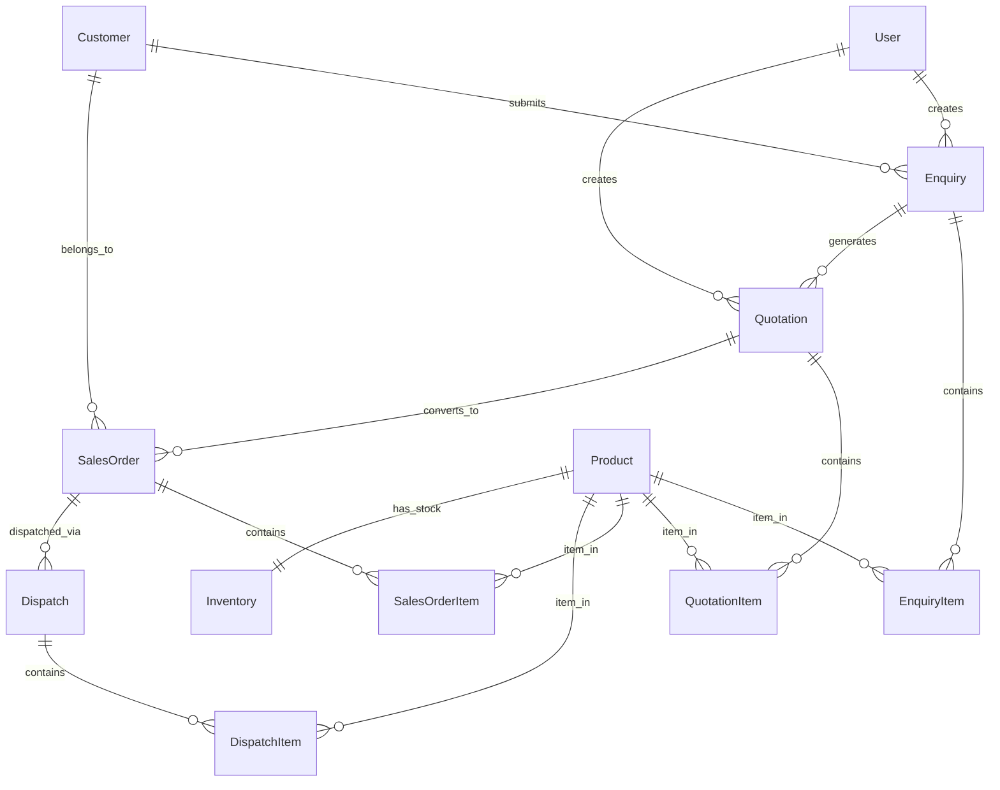
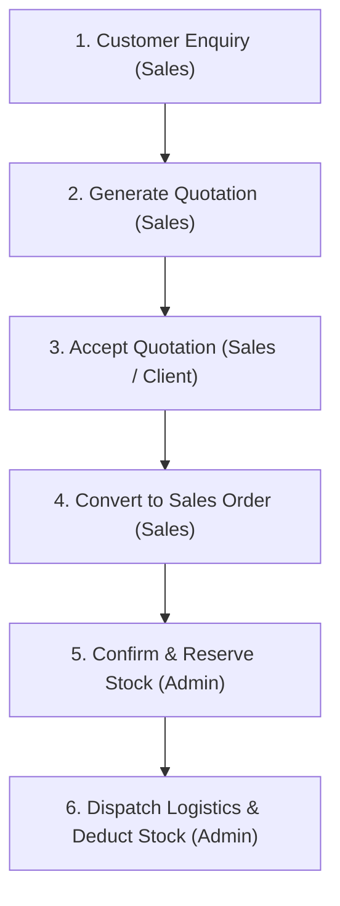

# 📚 PERN ERP Mini Application — Complete Technical Documentation

A comprehensive guide to the architecture, database schema, business logic, REST APIs, frontend design, testing, and deployment of the **PERN ERP Application**.

---

## 📑 Table of Contents
1. [System Architecture](#-system-architecture)
2. [Database Schema & ER Model](#-database-schema--er-model)
3. [End-to-End Business Flow](#-end-to-end-business-flow)
4. [Role-Based Access Control (RBAC)](#-role-based-access-control-rbac)
5. [REST API Specification](#-rest-api-specification)
6. [Frontend Application Architecture](#-frontend-application-architecture)
7. [Testing Strategy](#-testing-strategy)
8. [Installation & Setup Guide](#-installation--setup-guide)
9. [Troubleshooting & FAQ](#-troubleshooting--faq)

---

## 🏛️ System Architecture

The application is structured into decoupled layers following clean architecture principles:

```
┌──────────────────────────────────────────────────────────────┐
│                    React Frontend (Vite)                     │
│  - React 19 + TypeScript + Pure CSS Custom Design System     │
│  - React Router DOM v7 (Role-Based Route Guards)            │
│  - Axios Client with JWT Authorization Interceptor           │
└───────────────────────────────┬──────────────────────────────┘
                                │ JSON / HTTPS
                                ▼
┌──────────────────────────────────────────────────────────────┐
│                   Express.js Backend API                     │
│  - Node.js + TypeScript Runtime                              │
│  - JWT Authentication & RBAC Middleware                      │
│  - Transactional Business Logic & Inventory Guards           │
└───────────────────────────────┬──────────────────────────────┘
                                │ Prisma Client (@prisma/adapter-pg)
                                ▼
┌──────────────────────────────────────────────────────────────┐
│                 PostgreSQL Relational Database               │
│  - Tables: User, Customer, Product, Inventory, Enquiry,      │
│            EnquiryItem, Quotation, QuotationItem,            │
│            SalesOrder, SalesOrderItem, Dispatch, DispatchItem│
└──────────────────────────────────────────────────────────────┘
```

---

## 🗄️ Database Schema & ER Model

### Entity-Relationship Diagram



### Table Definitions

| Model | Key Fields | Purpose |
| :--- | :--- | :--- |
| **`User`** | `id`, `name`, `email`, `password_hash`, `role` | Admin & Sales personnel accounts with bcrypt hashed passwords |
| **`Customer`** | `id`, `company_name`, `contact_person`, `mobile`, `email`, `city` | Client directory |
| **`Product`** | `id`, `product_code`, `name`, `category`, `unit`, `base_price` | Item master catalog |
| **`Inventory`** | `id`, `product_id`, `physical_quantity`, `reserved_quantity` | Real-time warehouse stock tracking |
| **`Enquiry`** | `id`, `enquiry_number`, `customer_id`, `required_date`, `status` | Customer demand records |
| **`Quotation`** | `id`, `quotation_number`, `enquiry_id`, `valid_until`, `status` | Formal price quotation with GST & discounts |
| **`SalesOrder`** | `id`, `order_number`, `customer_id`, `quotation_id`, `total_amount`, `status` | Confirmed customer sales orders |
| **`Dispatch`** | `id`, `dispatch_number`, `sales_order_id`, `vehicle_number`, `driver_name` | Delivery logistics records |

---

## 🔄 End-to-End Business Flow



### Mathematical Formula for Quotation Items
$$\text{Line Amount} = (\text{Quantity} \times \text{Unit Price}) \times \left(1 - \frac{\text{Discount \%}}{100}\right) \times \left(1 + \frac{\text{GST \%}}{100}\right)$$

### Stock Calculation Logic
$$\text{Available Stock} = \text{Physical Quantity} - \text{Reserved Quantity}$$

- **Order Confirmation**: Increases `reserved_quantity` atomically if $\text{Order Quantity} \le \text{Available Stock}$.
- **Dispatch**: Decreases both `physical_quantity` and `reserved_quantity` simultaneously in a database transaction.

---

## 👥 Role-Based Access Control (RBAC)

| Resource / Action | ADMIN | SALES |
| :--- | :---: | :---: |
| **View Dashboard Metrics & Inventory** | ✅ | ✅ |
| **View Enquiries, Quotes, Sales Orders** | ✅ | ✅ |
| **Create Customer & Product** | ✅ | ✅ |
| **Create Enquiry & Quotation** | ❌ | ✅ |
| **Accept / Reject Quotation** | ❌ | ✅ |
| **Convert Quotation to Sales Order** | ❌ | ✅ |
| **Confirm Sales Order (Reserve Stock)** | ✅ | ❌ |
| **Dispatch Order (Fulfill Logistics)** | ✅ | ❌ |

---

## 📡 REST API Specification

### Authentication
#### `POST /api/auth/login`
Authenticates a user and returns a signed JWT.
- **Request Body**:
```json
{
  "email": "admin@example.com",
  "password": "admin123"
}
```
- **Response `200 OK`**:
```json
{
  "token": "eyJhbGciOiJIUzI1NiIsInR5cCI6IkpXVCJ9...",
  "role": "ADMIN",
  "name": "Admin User"
}
```

---

### Inventory
#### `GET /api/inventory`
Returns all products alongside live physical, reserved, and calculated available quantities.
- **Headers**: `Authorization: Bearer <token>`
- **Response `200 OK`**:
```json
[
  {
    "id": 1,
    "product_id": 1,
    "physical_quantity": 500,
    "reserved_quantity": 50,
    "available_quantity": 450,
    "product": {
      "product_code": "PROD-001",
      "name": "Industrial Ball Bearing 6205",
      "category": "Mechanical",
      "unit": "PCS",
      "base_price": 250.0
    }
  }
]
```

---

### Quotations
#### `POST /api/quotations`
Creates a new quotation with server-side pricing & GST calculation.
- **Role**: `SALES`
- **Request Body**:
```json
{
  "quotation_number": "QT-2026-001",
  "enquiry_id": 1,
  "valid_until": "2026-10-31T00:00:00.000Z",
  "items": [
    {
      "product_id": 1,
      "quantity": 50,
      "unit_price": 250,
      "discount_percent": 5,
      "gst_percent": 18
    }
  ]
}
```

#### `PATCH /api/quotations/:id/status`
Updates status to `SENT`, `ACCEPTED`, or `REJECTED`.
- **Role**: `SALES`
- **Request Body**: `{ "status": "ACCEPTED" }`

#### `POST /api/quotations/:id/convert`
Converts an `ACCEPTED` quotation into a confirmed `SalesOrder`.
- **Role**: `SALES`
- **Request Body**: `{ "order_number": "SO-2026-001" }`

---

### Sales Orders & Dispatch
#### `POST /api/sales-orders/:id/confirm`
Reserves stock in the inventory table.
- **Role**: `ADMIN`
- **Response**: `200 OK` or `400 Bad Request` if stock is insufficient.

#### `POST /api/sales-orders/:id/dispatch`
Creates a dispatch slip and releases reserved stock from physical inventory.
- **Role**: `ADMIN`
- **Request Body**:
```json
{
  "dispatch_number": "DSP-2026-001",
  "vehicle_number": "MH-12-AB-9876",
  "driver_name": "Rajesh Kumar"
}
```

---

## 🎨 Frontend Application Architecture

The frontend is built with **React 19 + TypeScript + Vite**:

- **Context (`AuthContext`)**: Manages current user session, token decoding, and role persistence via `localStorage`.
- **Axios Interceptor**: Automatically attaches `Authorization: Bearer <token>` headers and redirects on `401 Unauthorized`.
- **Theme**: Custom high-contrast enterprise design system with responsive sidebar, KPI cards, modal dialogues, and tabular grids.
- **Views**:
  - `Dashboard`: Real-time KPI summaries, inventory charts, recent orders.
  - `Enquiries`: Customer enquiry registration and list.
  - `Quotations`: Line item builder with automatic pricing computation and status actions.
  - `Sales Orders`: Order tracking, inventory reservation triggers, and dispatch dialog.
  - `Inventory`: Live stock levels with visual stock health indicators.

---

## 🧪 Testing Strategy

Backend automated testing is implemented with **Jest** and **Supertest**:

```powershell
cd backend
npm test
```

### Coverage:
1. **Mathematical Accuracy**: Validates correct calculation of discounts and GST.
2. **Workflow State Guard**: Prevents non-accepted quotations from being converted to Sales Orders.
3. **Double Conversion Prevention**: Blocks duplicate Sales Orders from the same quotation.
4. **Stock Reservation Limits**: Rejects order confirmation when required quantity > available quantity.
5. **Role-Based Protection**: Validates that unauthorized roles receive `403 Forbidden`.

---

## 🚀 Installation & Setup Guide

### 1. Clone & Dependencies
```bash
git clone https://github.com/Omrasal7/pern-app.git
cd pern-app
```

### 2. Backend Setup
```bash
cd backend
npm install
# Configure your .env
npx prisma migrate dev --name init
npm run prisma:seed
npm run dev
```

### 3. Frontend Setup
```bash
cd ../frontend
npm install
npm run dev
```

---

## 💡 Default Test Credentials

| Role | Email | Password |
| :--- | :--- | :--- |
| **Admin User** | `admin@example.com` | `admin123` |
| **Sales Executive** | `sales@example.com` | `sales123` |
